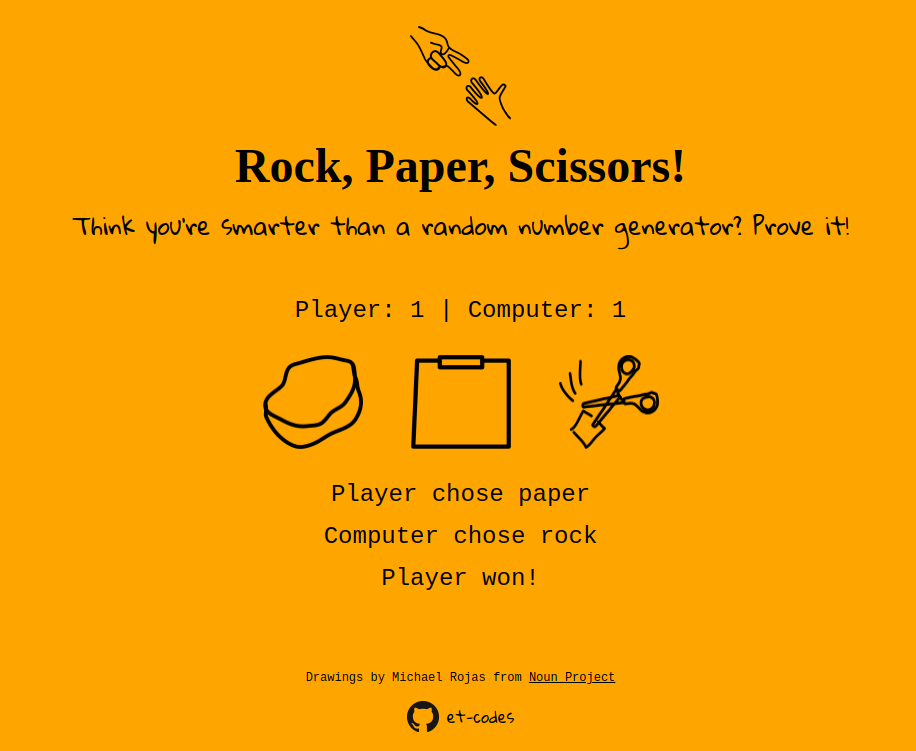

# Rock, Paper, Scissors!

_Play the classic game of random selection versus the computer! Can you beat the ~~Math.random()~~ AI opponent?_

**You can play the game [here](https://et-codes.github.io/rps).**

This project was written with vanilla HTML, CSS, and JavaScript. It was fun to code, and was completed in a couple of hours.

One challenge I wanted to tackle was to make sure the player had positive feedback when making a selection. The first step was to make the icon grow in size when hovering with the mouse. The problem there was that it's not uncommon that the player makes the same selection as the last round, and the computer does too. In that case, there is no change on the screen except for the score, if the result is not a tie, and that can be easy to miss. To rectify that, I made the display go blank with every update, and then introduced a small delay before updating it again. That way the game results "flash" with every player selection.

**Author:** Eric Thornton
